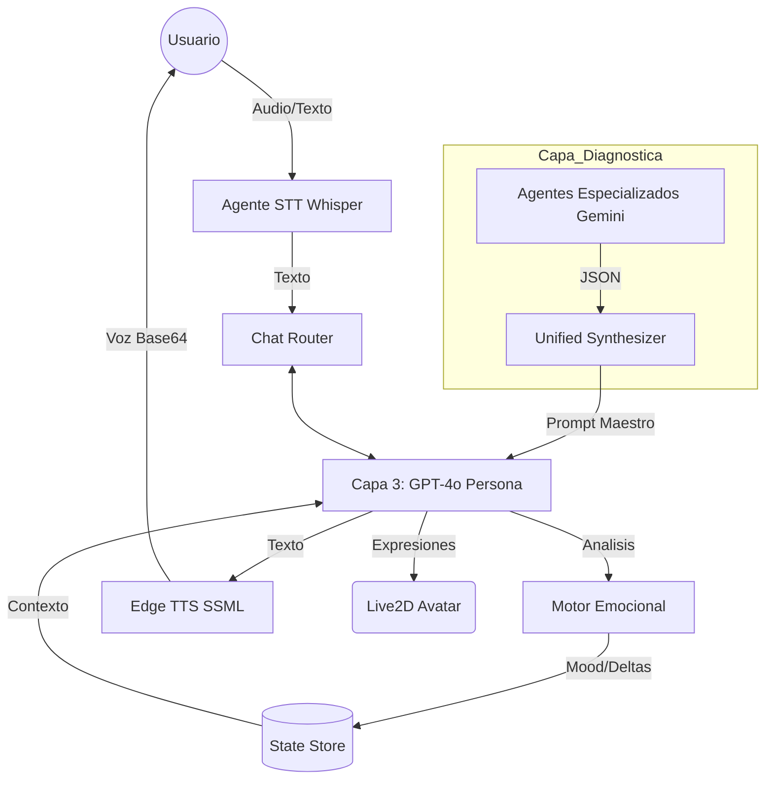

# 🧠 Arquitectura del Cerebro de Eleonor (Backend)

Esta documentación detalla la infraestructura cognitiva de Eleonor, un sistema de IA de tres capas diseñado para el acompañamiento profundo, integrando análisis técnico con una capa de adaptación emocional en tiempo real.

---

## 1. Arquitectura de Tres Capas (The Cognitive Stack)

Eleonor no es un solo modelo de lenguaje; es un ecosistema de agentes que operan en niveles de abstracción creciente:

### Capa 1: Agentes de Diagnóstico Especializados (The Specialists)
Ubicación: `server_py/core/gemini_pro_diagnostic/`

Cuando el usuario realiza un examen o interactúa, se activan agentes especializados en dominios específicos. Cada uno utiliza **Gemini 1.5 Flash** por su velocidad y capacidad de análisis técnico.

*   **Agente Matemático:** Evalúa abstracción y lógica secuencial.
*   **Agente Científico:** Evalúa pensamiento crítico e hipótesis.
*   **Agente Humanista:** Evalúa empatía, ética y comprensión sistémica.
*   **Agente de Ingeniería:** Evalúa pensamiento de diseño y eficiencia.
*   **Agente Médic:** Evalúa retención de sistemas y precisión técnica.
*   **Agente Cognitivo (Core):** Calibra a los demás midiendo memoria de trabajo y flexibilidad mental.

**Salida Técnica:** Generan un JSON estricto con métricas de nivel (0-100), razonamiento, fatiga detectada y observaciones de potencial.

---

### Capa 2: Sintetizador Unificado (The Orchestrator)
Ubicación: `unified_synthesizer.py`

Esta capa actúa como el "puente" entre el análisis técnico y la personalidad. Recibe todos los reportes JSON de la Capa 1 y los consolida en un **Prompt Maestro**.

*   **Detección de Contradicciones:** Si el agente de matemáticas reporta fatiga pero el cognitivo reporta alta motivación, el sintetizador crea una narrativa de "fricción por sobreesfuerzo".
*   **Construcción de Perfil:** Crea un resumen ejecutivo que Eleonor "leerá" para entender a quién tiene enfrente sin ver los números crudos.

---

### Capa 3: Capa de Personalidad y Adaptación (Eleonor Core)
Ubicación: `personality.py` y `chat.py`

Aquí reside el modelo **GPT-4o-Mini**, encargado de la interacción final. Esta capa recibe el resumen de la Capa 2 y lo inyecta en su sistema de prompts dinámicos.

*   **Mantra Interno:** Eleonor opera bajo la premisa: *"No estoy aquí para empujarte, sino para no soltarte"*.
*   **Reglas de Privacidad:** Tiene prohibido mencionar métricas, números o el término "diagnóstico". Su adaptación debe ser **actuada**, no verbalizada.

---

## 2. El Motor Emocional (The Feedback Loop)

Eleonor mantiene un estado mental persistente llamado `eleonor_state` que evoluciona en cada mensaje del chat.

### Métricas del Motor:
1.  **Valence (Valencia):** Grado de positividad/negatividad de la interacción.
2.  **Tension (Tensión):** Nivel de estrés o presión detectada en el usuario.
3.  **Engagement (Interés):** Nivel de conexión y flujo con la actividad.

### Funcionamiento del Ciclo:
1.  **Input:** El usuario envía un texto.
2.  **System Prompt Dinámico:** El backend genera un prompt que incluye el estado actual del motor y el diagnóstico de la Capa 2.
3.  **Tag Analysis:** Eleonor responde con un formato estructurado invisible para el usuario:
    *   `[DECISION]`: Indica si debe responder, pausar o redirigir.
    *   `[ANALISIS]`: Devuelve deltas (ej: `{"t": +0.1}`) para actualizar el motor.
    *   `[TEXTO]`: La respuesta humana.
4.  **Actualización:** El backend intercepta el `[ANALISIS]`, actualiza el estado global y dispara la expresión facial correspondiente en el frontend.

---

## 3. Lógica de Intervención Adaptativa

Según el estado del motor y el diagnóstico, Eleonor cambia su estrategia de comunicación automáticamente:

| Estrategia | Desencadenante | Comportamiento |
| :--- | :--- | :--- |
| **Fragmentado** | Riesgo de abandono alto / Tensión > 0.8 | Respuestas ultra-breves, valida el peso, no pide nada. |
| **Guiado** | Nivel de autonomía bajo | Propone pasos minúsculos y obvios. |
| **Autónomo** | Nivel de confianza alto | Intervención mínima, desafía sutilmente. |
| **Pausa Silenciosa** | Bloqueo cognitivo total | Sugiere dejar de trabajar y reposar. |

---

## 4. Tecnologías y Flujo de Datos

### Stack Tecnológico Principal:
*   **Gemini 1.5 Flash:** Para el análisis técnico profundo y multi-agente (Capa 1 y 2).
*   **GPT-4o / GPT-4o-Mini:** Para el razonamiento dialéctico y la capa de personalidad (Capa 3).
*   **Edge TTS:** Para la generación de voz con soporte SSML dinámico según el humor detectado.
*   **FastAPI:** Orquestador de alta velocidad que maneja el streaming de eventos (Server-Sent Events).

---

## 5. El Mantra de Sostén

A diferencia de otras IAs que buscan ser eficientes, el backend de Eleonor está programado para ser **ineficiente cuando el usuario lo necesita**. Si el motor detecta que el usuario está agotado, el backend tiene permiso explícito para responder con silencio conceptual o simplemente una frase de presencia, priorizando la salud mental sobre el progreso académico.
