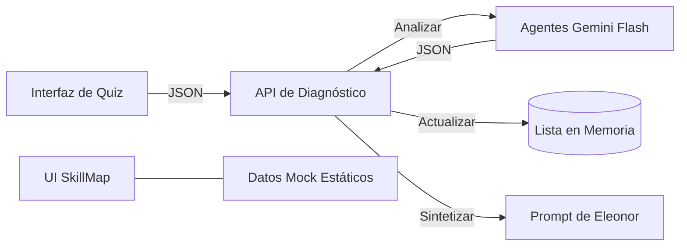
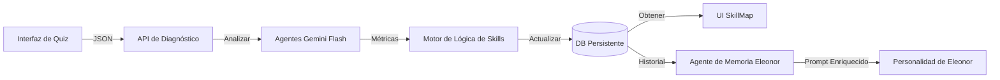

# 📊 Documentación Comparativa: Evolución de Skill-Tech

Este documento describe el estado actual de los sistemas de Exámenes y SkillMap, así como el estado objetivo propuesto para la siguiente fase de desarrollo.

## 1. Resumen Ejecutivo
El sistema actual cuenta con un **Núcleo de IA de Diagnóstico** robusto, pero carece de **Conectividad entre módulos** y **Persistencia de Datos**. El estado objetivo se centra en crear un "bucle cerrado" donde los exámenes actualicen directamente el SkillMap del usuario, el cual a su vez informará la estrategia de retroalimentación de Eleonor.

---

## 2. Análisis Comparativo

| Característica | Estado Actual (v1.0) | Estado Objetivo (v2.0) | Análisis de Brecha (Gap) |
| :--- | :--- | :--- | :--- |
| **Agentes de IA** | 7 Agentes base (Mat, Ciencia, etc). | 12+ Agentes con Diagnóstico Cognitivo y Personal. | Expansión de Personas en `diagnosis_ai.py`. |
| **Feedback de Eleonor** | Basado en el "Prompt Maestro" de la sesión. | Bucle adaptativo basado en "Estados Comprimidos". | Prevención de 'Token Death' mediante resúmenes. |
| **Ux de Feedback** | Menciona resultados o niveles. | Conversacional, intuitivo, sin mencionar "exámenes". | Eleonor habla desde el conocimiento, no desde el reporte. |
| **Actualización Skillmap** | Manual / Hardcoded. | Única fuente de verdad para la estrategia de Eleonor. | Sincronización DB <-> Prompt dinámico. |

---

## 3. Arquitectura Actual (Basada en Memoria)

## 4. Arquitectura Objetivo (Basada en Datos)

---

1.  **Persistencia Estructural**: Cada intento se registra, permitiendo el historial en el SkillMap.
2.  **Optimización de Contexto (Estado Comprimido)**: Eleonor no lee exámenes, lee tendencias y snapshots resumidos para evitar amnesia por exceso de tokens.
3.  **EleonorHistory (No es un Log)**: Almacena tendencias, hitos cognitivos y señales (ej: `razonamiento_up`), no conversaciones crudas.
4.  **UX No Invasiva**: Eleonor habla como si "ya supiera" el estado del usuario, evitando frases técnicas como "según tu último test".
5.  **Bucle de Feedback**: Integración profunda entre el SkillMap (fuente de verdad) y el Prompt dinámico.
